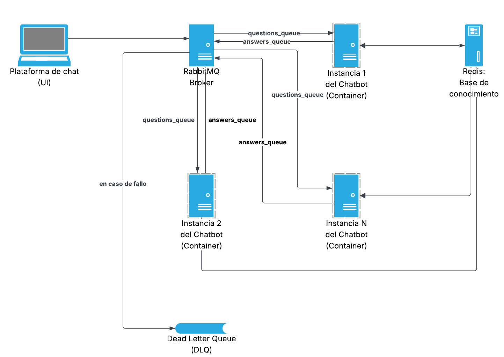

# Arquitectura profesional del microservicio: Chatbot Académico

En este documento se describe la arquitectura de grado de producción para el microservicio realizado de Chatbot. El diseño utilizado se enfoca en **escalabilidad, resiliencia,seguridad y mantenibilidad**, los cuales son principios fundamentales al crear y usar sistemas distribuidos modernos.

## 1. Como visión general:

Este sistema sigue siendo un microservicio puramente **event-driven** pero ahora se potencia con componentes externos y patrones de diseño que aseguran la robustez necesaria. La responsabilidad primordial sigue siendo consumir preguntas de una cola de mensajes y publicar las respuestas de estas, pero ahora lo hace de forma más fiable.

## 2. Componentes y patrones de diseño:

### Lógica del Chatbot (como consumidor desacoplado)

El eje del servicio sigue siendo un consumidor de RabbitMQ, pero ahora es sin estado en su totalidad, es decir, **stateless**. Lo mencionado es crucial para la escalabilidad

-   Funcionamiento:
    1.  Múltiples instancias del servicio se suscriben a `questions_queue` (se usa patrón "Competing consumers"). Luego RabbitMQ distribuye la carga entre todas ellas.
    2.  Al recibir un mensaje, el bot consulta una base de datos externa (Redis en este caso) para obtener la respuesta correspondiente.
    3.  Se publica la respuesta en `answers_queue`.

### Base de conocimiento externa (usando Redis)

-   La razón: Se externaliza la base de conocimiento **(FAQs)** a una base de datos en memoria como lo es Redis en este caso.
-   Como se logra la escalabilidad: Al no guardar el estado en el propio servicio, podemos lanzar varias instancias del chatbot y todas compartirán la misma fuente. Además, Redis es muy rápido para este tipo de consultas clave-valor debido a que almacena datos en memoria **RAM** en vez de disco.

### Broker de mensajes (RabbitMQ)

-   La razón: Actúa como el sistema central del servicio, desacoplando la producción de preguntas del consumo de estas.
-   Como se logra la resiliencia:
    -   Durabilidad: Las colas y los mensajes se configuran como duraderos, así, si el servicio del chatbot se cae, los mensajes esperarán de forma segura en la cola hasta que el servicio se recupere.
    -   Dead Letter Queue (DLQ): Se configura una DLQ para que, si un mensaje falla repetidamente, en lugar de bloquear la cola principal, se mueve a la cola `questions_dlq` para hacerle un análisis manual, permitiendo que el sistema siga procesando los mensajes que si son válidos.

### Dockerización y su orquestación

-   La razón: Empaquetar y ejecutar la aplicación junto con sus dependencias (RabbitMQ, Redis, Librerías, etc.) de forma consistente.
-   Como se logra la mantenibilidad: `docker-compose` nos permite definir y levantar todo el stack facilmente con un solo comando.

## 3. Pilares del diseño:

### Escalabilidad

-   Escalado Horizontal: Gracias a que el servicio es stateless, y usa el patrón Competing Consumers de RabbitMQ, podemos escalar simplemente aumentando el número de réplicas del contenedor `chatbot_service`
-   Base de datos escalable: Redis está diseñado para lograr un alto rendimiento y puede ser clusterizado  si la carga de consultas de **FAQs** crece masivamente

### Resiliencia

-   Reintentos de conexión: El servicio reintenta conectarse a RabbitMQ y Redis si no están disponibles al inicio
-   Manejo de mensajes que fallan repetidamente: La DLQ evita que un mensaje malformado detenga todo el procesamiento
-   **Cierre elegante: El servicio captura las señales de terminación (`SIGTERM`) para asegurar que se termina de procesar un mensaje en curso antes de apagarse así evitando la pérdida de datos

### Seguridad

-   **Gestión de secretos:** Las credenciales ya no están en el `docker-compose.yml`, se gestionan a través de variables de entorno y un archivo `.env`, que en producción sería reemplazado por un sistema de gestión de secretos popular y compatible como HashiCorp Vault, Azure Key Vault, AWS Secrets Manager, etc.
-   Conexiones seguras: Se recomienda el uso de AMQPS/TLS para cifrar la comunicación entre el servicio y RabbitMQ en un entorno de producción.
-   Mínimo privilegio: Se debe crear un usuario específico en RabbitMQ para el chatbot con permisos solo para las colas que necesita en vez de usar el usuario administrador

### Observabilidad

-   Logging estructurado: Se reemplazan los `print()` por un sistema de `logging` formal, para así poder analizar y monitorear el comportamiento del servicio con herramientas centralizadas (ELK, Datadog, etc.)
-   Configuración centralizada: Todas las configuraciones (nombres de colas, hosts, etc.) se manejan a través de variables de entorno, haciendo el servicio adaptable a diferentes entornos distintos (desarrollo, producción) sin tener que cambiar el código

## 4. Diagrama de flujo:

